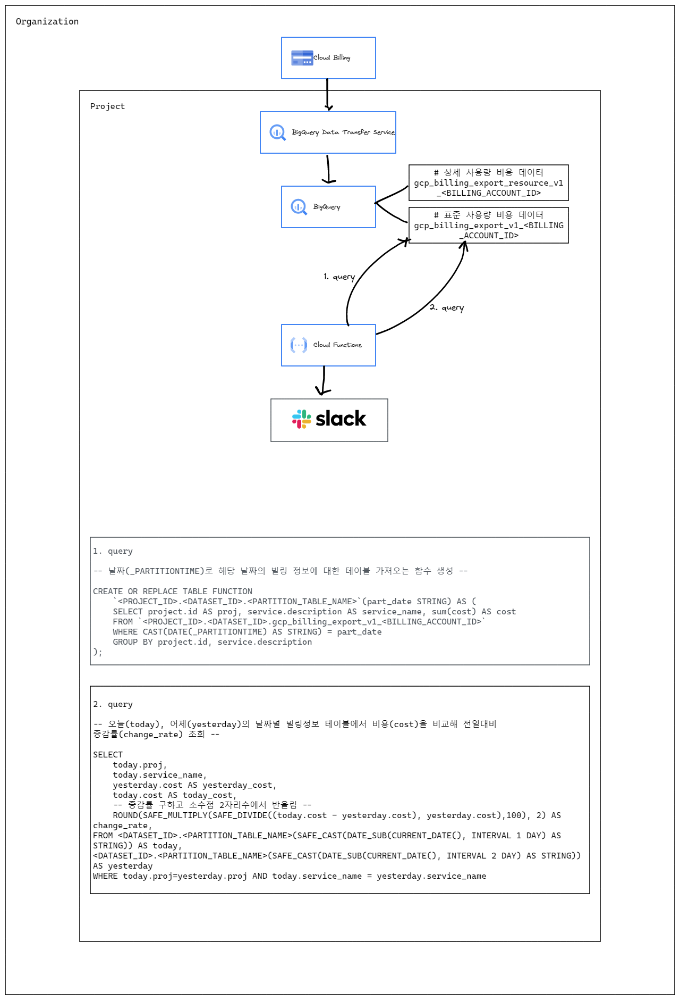

# Billing export notification

## 배경

비용이 많이 나가는 서비스 또는 프로젝트에 대한 알람을 보내어 빠른 대처를 하는 것

## 목표

일 단위로 비용을 비교(전일 대비 오늘 비용)하여 증감률이 특정 기준치 이상으로 상승한 경우, 알림 보내기

## 구성



## 구현

### [BigQuery로 Cloud Billing 데이터 내보내기 설정](https://cloud.google.com/billing/docs/how-to/export-data-bigquery-setup?hl=ko#how-to-enable)

1. [이 작업에 필요한 권한](https://cloud.google.com/billing/docs/how-to/export-data-bigquery-setup?hl=ko#required_permissions)

2. [BigQuery 데이터 세트 만들기](https://cloud.google.com/billing/docs/how-to/export-data-bigquery-setup?hl=ko#create-bq-dataset)

3. [Cloud Billing을 BigQuery 데이터 세트로 내보내기 사용 설정](https://cloud.google.com/billing/docs/how-to/export-data-bigquery-setup?hl=ko#enable-bq-export)

   > - [표준 사용량 비용 데이터](https://cloud.google.com/billing/docs/how-to/export-data-bigquery-tables?hl=ko#standard-usage-cost-data-schema)(**필수**) - 계정 ID, 인보이스 날짜, 서비스, SKU, 프로젝트, 라벨, 위치, 비용, 사용량, 크레딧, 조정, 통화 등의 표준 Cloud Billing 계정 비용 사용량 정보를 포함합니다.
   > - [상세 사용량 비용 데이터](https://cloud.google.com/billing/docs/how-to/export-data-bigquery-tables?hl=ko#detailed-usage-cost-data-schema)(옵션) - 자세한 Cloud Billing 계정 비용 사용량 정보를 포함합니다. 표준 사용량 비용 데이터의 모든 정보와 서비스 사용량을 생성하는 가상 머신 또는 SSD 등 리소스 수준의 비용 데이터를 포함합니다.
   > - [가격 책정 데이터](https://cloud.google.com/billing/docs/how-to/export-data-bigquery-tables?hl=ko#pricing-data-schema)(옵션, BigQuery Transfer Service API 필요) - 계정 ID, 서비스, SKU, 제품, 지역 메타데이터, 가격 책정 단위, 통화, 집계, 등급과 같은 Cloud Billing 계정 가격 책정 정보가 포함됩니다.

4. Cloud Function 배포

   ```bash
   export PROJECT_ID=$(gcloud config get-value project)
   export CLOUDFUNCTION_REGION=us-central1
   export MEMORY_LIMIT=256Mi
   export SOURCE_PATH=.
   export BILLING_ACCOUNT_ID=<YOUR_BILLING_ACC_ID>
   export DATASET_ID=billing_export_dataset
   export PARTITION_TABLE_NAME=cost_partition_table
   export SLACK_OAUTH_TOKEN=<YOUR_SLACK_OAUTH_TOKEN>
   export SLACK_CHANNEL_ID=<YOUR_SLACK_CHANNEL_ID>
   export DETECT_ABNORMALY_PERCENTAGE=50.0

   gcloud functions deploy go-billing-notification-func \
   --project=$PROJECT_ID \
   --gen2 \
   --runtime=go120 \
   --region=$CLOUDFUNCTION_REGION \
   --trigger-http \
   --memory=$MEMORY_LIMIT \
   --source=$SOURCE_PATH \
   --entry-point=BillingNotiFunc \
   --set-env-vars=BILLING_ACCOUNT_ID=$BILLING_ACCOUNT_ID,DATASET_ID=$DATASET_ID,PARTITION_TABLE_NAME=$PARTITION_TABLE_NAME,SLACK_OAUTH_TOKEN=$SLACK_OAUTH_TOKEN,SLACK_CHANNEL_ID=$SLACK_CHANNEL_ID,DETECT_ABNORMALY_PERCENTAGE=$DETECT_ABNORMALY_PERCENTAGE
   ```

5. 테스트
   ```bash
   export CLOUDFUNCTION_REGION=us-central1
   export CLOUDFUNCTION_URI=$(gcloud functions describe go-billing-notification-func --region $CLOUDFUNCTION_REGION --gen2 --format json | jq -r '.serviceConfig.uri')
   curl -m 70 -X POST $CLOUDFUNCTION_URI \
   -H "Authorization: bearer $(gcloud auth print-identity-token)"
   ```
   _TODO. Cloud Scheduler를 통한 주기적인 알람 설정 작업 필요_

## 삭제

```bash
PROJECT_ID=$(gcloud config get-value project)
PROJECT_NUMBER=$(gcloud projects list --filter="project_id:$PROJECT_ID" --format='value(project_number)')
CLOUDFUNCTION_REGION=us-central1

gcloud functions delete go-billing-notification-func --project=$PROJECT_ID --region=$CLOUDFUNCTION_REGION -q

gcloud storage rm --recursive gs://gcf-v2-sources-$PROJECT_NUMBER-$CLOUDFUNCTION_REGION/

gcloud storage rm --recursive gs://gcf-v2-uploads-$PROJECT_NUMBER-$CLOUDFUNCTION_REGION/
```

## 참고사항

### [데이터 세트 권한 정보](https://cloud.google.com/billing/docs/how-to/export-data-bigquery-setup?hl=ko#about_dataset_permissions)

> - 표준 및 세부 사용량 비용 데이터 세트: `billing-export-bigquery@system.gserviceaccount.com`
> - 가격 책정 데이터 세트: `cloud-account-pricing@cloud-account-pricing.iam.gserviceaccount.com`

> **경고: 데이터 세트에서 서비스 계정을 삭제하지 마세요.** BigQuery로 Cloud Billing 내보내기가 사용 설정되었을 때 서비스 계정을 삭제하면 테이블이 업데이트되지 않아 데이터 손실 위험이 있습니다. 서비스 계정을 삭제한 경우 수동으로 다시 추가하거나 BigQuery로 Cloud Billing 내보내기를 사용 중지한 후 다시 사용 설정해야 합니다.

### 결제 데이터 테이블

> Cloud Billing을 BigQuery로 내보내기를 사용 설정한 직후 결제 데이터 테이블이 BigQuery 데이터 세트에 자동으로 생성됩니다. 이러한 BigQuery 테이블 및 테이블 스키마에 대한 자세한 내용은 [BigQuery에서 자동 생성된 데이터 테이블 이해하기](https://cloud.google.com/billing/docs/how-to/export-data-bigquery-tables?hl=ko)를 참조하세요.

### 데이터 로드 빈도

> - BigQuery로 **표준** 또는 **상세 사용량 비용** 내보내기를 처음 사용 설정하면 Google Cloud 비용 데이터가 표시되는 데 몇 시간이 걸릴 수 있습니다.
> - BigQuery로 **가격** 내보내기를 처음 사용 설정하면 Google Cloud 가격 책정 데이터가 표시되는 데 최대 48시간이 걸릴 수 있습니다.

> BigQuery 테이블로 로드하는 데이터 빈도에 대한 자세한 내용은 [데이터 로드 빈도](https://cloud.google.com/billing/docs/how-to/export-data-bigquery-tables?hl=ko#data-loads)를 참조하세요.

## [제한사항](https://cloud.google.com/billing/docs/how-to/export-data-bigquery-setup?hl=ko#limitations)
